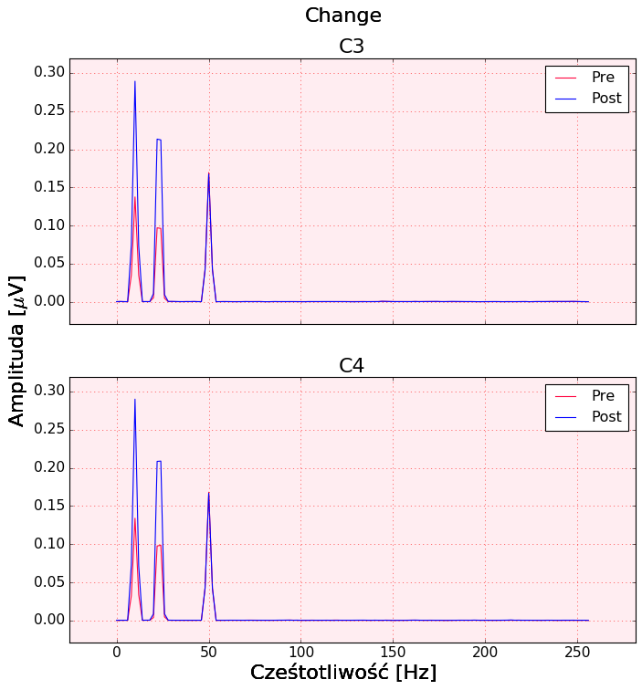

# Saffy: Signal Analysis made simple


[](https://github.com/saffy-team/saffy/blob/master/LICENSE.txt)

## A High-Level Signal Analysis Framework

A simple signal analysis framework, which aims at clarity of code and reproducibility of solutions. The plugin architecture
aims to encourage building modular code among scientists and data analysts. It provides a basic structure for signal
storage and a pipeline for analysis.

[Documentation](https://saffy-team.github.io/saffy/)

## Install

`pip3 install saffy`

###### From Source
Using a virtualenv is recommended! 

Download the package to your project directory

`git clone https://github.com/PPierzc/saffy.git`

Install dependencies

`pip3 install -r ./saffy/requirements.txt`

## Usage
```python
import saffy
sig = saffy.SignalManager(generator=signal_data)
```

#### Basic SignalManager instance structure
| field | description |
|--------|------|
| fs   | sampling frequency  |
| num_channels | number of channels |
| channel_names | name for each channel |
| data | the signal in the structure of (epoch x channel x signal) |
| t | time vector |
| epochs | number of epochs |
| tags | position of tags in signal |
| spectrum | matrix of spectrum |
| spectrum_freqs| vector of frequencies |
| phase | matrix of phase |

#### SignalManager init function
It takes one labelled argument: `generator` or `filename`.

###### Generator
A dictionary of the structure
```
data = {
      'fs': # float,
      'num_channels': # integer,
      'channel_names': # list of strings,
      'epochs': # integer,
      't': # time array,
      'tags': # list,
      'data': # Signal Matrix
  }
```

```python
saffy.SignalManager(generator=data)
```

###### Filename
The name of the file generated by Svarog. 3 files eg. `data.raw`, `data.xml`, `data.tag`

```python
saffy.SignalManager(filename='data')
```

## Plugins
Plugins are classes that inherit from the PluginManager. They extend the functionality of the basic Signal Manager.
Some plugins are provided out of the box

#### Filters
Adds basic filters

#### Graphics
Adds functions to display the signal data

#### Welch
Calculating the Welch Spectrum

#### Hilbert
Calculating the Hilbert Transform

### Creating Custom Plugins
You might want to add some custom features.

The proposed convention for plugin development is the following.
All data that is to be stored extra, should be stored in the form of a dictionary assigned to a variable of the same name
as the plugin.

Plugin functions should be preceded by the plugin name. 

```python
import saffy

class CustomPlugin(saffy.PluginManager):
    def __init__(self, *args, **kwargs):
        super().__init__(*args, **kwargs)

        self.custom = {
            'param': 'some value'
        }
        
    def custom_function(self):
        # do something
        pass
        
saffy.SignalManager.register_plugin(CustomPlugin)

sig = saffy.SignalManager(generator=signal_data)

sig.custom_function()
```

## Example
A short example of how to use saffy for EEG data analysis.

```python
EEG = saffy.SignalManager(filename="path/to/file")

EEG.extract_channels(['C3', 'C4', 'trig'])

EEG.set_tags_from_channel('trig')

EEG.remove_channel('trig')

EEG.butter_highpass_filter_v2(1, 2)
EEG.cheb2_notch_filter_v2(50, order=1, rs=3, width=0.3, btype='bandstop')

PRE_EEG = EEG.copy('pre')
PRE_EEG.set_epochs_from_tags(-4, -2)

PRE_EEG.welch_spectrum()
PRE_EEG.spectrum = np.mean(PRE_EEG.spectrum, axis=0)
PRE_EEG.spectrum = np.reshape(PRE_EEG.spectrum, (1, *PRE_EEG.spectrum.shape))

POST_EEG = EEG.copy('post')
POST_EEG.set_epochs_from_tags(0.5, 2.5)

POST_EEG.welch_spectrum()
POST_EEG.spectrum = np.mean(POST_EEG.spectrum, axis=0)
POST_EEG.spectrum = np.reshape(POST_EEG.spectrum, (1, *POST_EEG.spectrum.shape))

fig, ax = plt.subplots(
    nrows=max([PRE_EEG.num_channels, POST_EEG.num_channels]),
    ncols=1,
    sharex=True,
    sharey=True,
    figsize=(10, 10)
)

PRE_EEG.graphics_spectrum_plot(
    fig,
    ax,
    'Change',
    label='Pre'
)

POST_EEG.graphics_spectrum_plot(
    fig,
    ax,
    color='#0000ff',
    label='Post'
)

for a in ax:
  a.legend()

plt.show()
plt.close()
```


## Contributing
If you like the project and want to add something to it then please create a pull request.
- The title should shortly summarize the goal of your addition
- In the description go in depth with the changes you have made and why.
